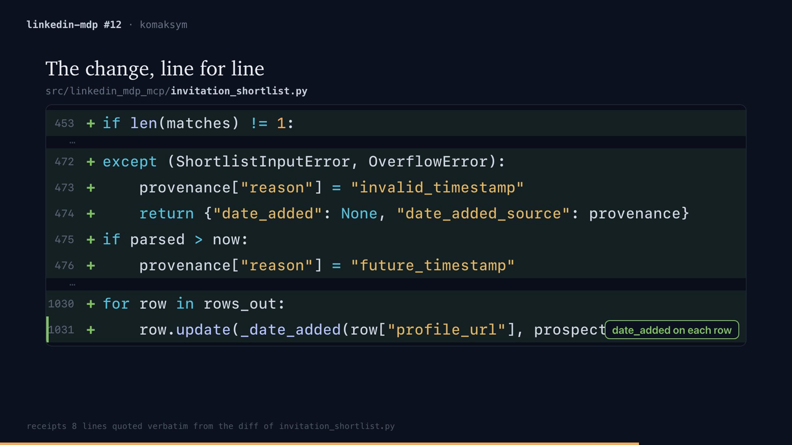

# Release readiness, 2026-10-07

## Summary

The explainer is implemented, but the product does not meet its frozen release criteria. Packaging and runtime verification are separate from product acceptance. Do not describe this candidate as a passing MVP.

## Implemented product

The package has the CLI, static code map, evidence checker, highlighted diff video, offline walkthrough, card, comment draft, voice backends, doctor, and agent instructions. Twelve corpus PRs have saved output sets. Eight implemented gate checks report 96 passing cells. The public-corpus arrow check passes on current outputs: 28/28 PRs, 882/885 supported edges, 99.66% against the 99% target (artifacts/release/arrows/verification.log).

The source archive excludes local experiments, worktrees, audit logs, evaluation files, and internal reports. Runtime regression tests cover default relative output, stored maps without git, rebuilt brief signals, and captured versus live provenance. The release verification script is `scripts/verify-release.sh`.

## Product acceptance remains open

The final saved grades contain 480 answers. Correct results are 20.8% for the card, 25.0% for the comment, 46.9% for video, 69.8% for the walkthrough, and 17.7% for the map. There are 44 wrong answers. All four absolute targets fail. Only the walkthrough clears the required improvement over C0. The [scoreboard](../../eval/runs/2026-10-06-full/scoreboard.md) lists the exact counts and missing evidence.

Recorded audits predate some wording fixes. A current grounding audit needs independent verification and a valid planted-error judge check. The run also lacks current OCR and three-warm-run timing medians; arrow precision is verified as above. The original baseline reader also authored its questions. Preserve the frozen questions and targets when rerunning readers.

The records do not prove three consecutive scored fix rounds. Count completed fix rounds explicitly before invoking the stop rule in [PLAN.md](../mvp/PLAN.md). A failed target cannot become a pass by changing its definition.

## Human review is prepared

The [session sheet](../../eval/human/2026-10-07.md) contains PR 12, 16, and 19, ten blind grader checks, and five historical audit checks. Audible copies use the existing macOS voice and are separate from frozen scored outputs. All human answers remain blank. Acceptance requires adoption for two of three PRs and agreement on eight of ten grades.

## Publishing decisions

The user must choose a license and repository name. Public publication also requires a private-content and history review. [PUBLISH.md](PUBLISH.md) lists the operator steps. No repository push, package upload, promotional post, or skill installation into the user's real configuration has occurred in this run.
