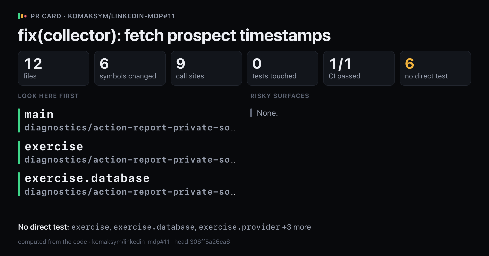
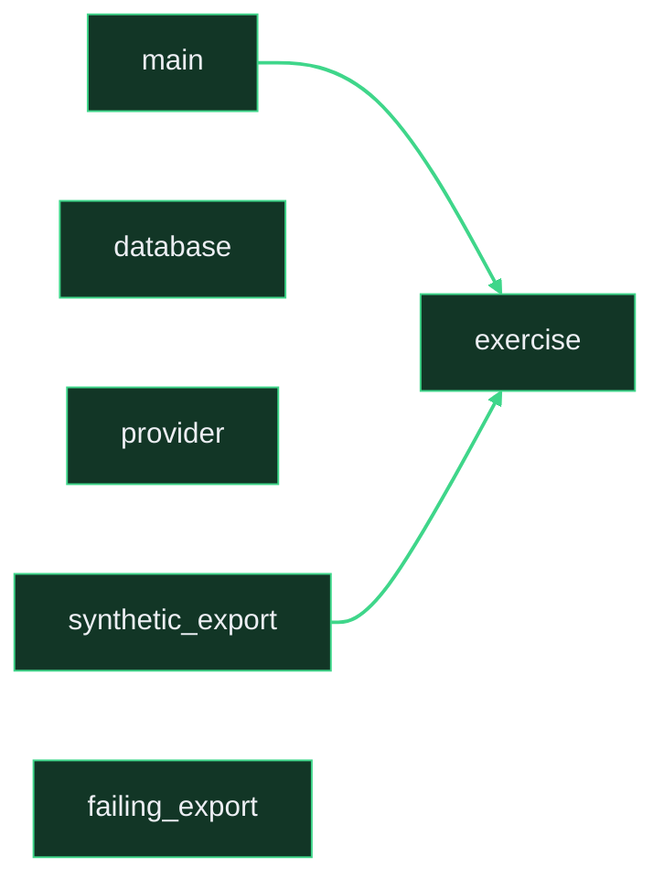

# `fix(collector): fetch prospect timestamps`

Upload `card.png` with this comment: images do not embed from the repo.

## Look here first

- `main` in `diagnostics/action-report-private-source-20261002/e2e_private_source.py`
- `exercise` in `diagnostics/action-report-private-source-20261002/e2e_private_source.py`
- `exercise.database` in `diagnostics/action-report-private-source-20261002/e2e_private_source.py`

## Risky surfaces and description vs diff

No risky surfaces.
Everything the description names is in the diff.

## Not covered by tests

- `exercise` in `diagnostics/action-report-private-source-20261002/e2e_private_source.py`
- `exercise.database` in `diagnostics/action-report-private-source-20261002/e2e_private_source.py`
- `exercise.provider` in `diagnostics/action-report-private-source-20261002/e2e_private_source.py`
- `main` in `diagnostics/action-report-private-source-20261002/e2e_private_source.py`
- `main.failing_export` in `diagnostics/action-report-private-source-20261002/e2e_private_source.py`
- `main.synthetic_export` in `diagnostics/action-report-private-source-20261002/e2e_private_source.py`

Files 12, symbols 6, CI 1/1.

*Written by prc from the code at head `306ff5a26ca6`.*
