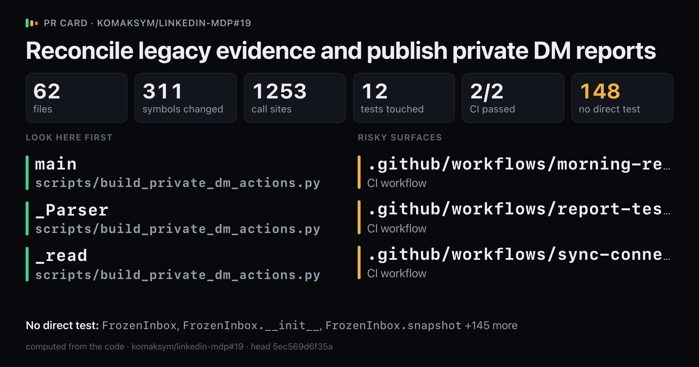
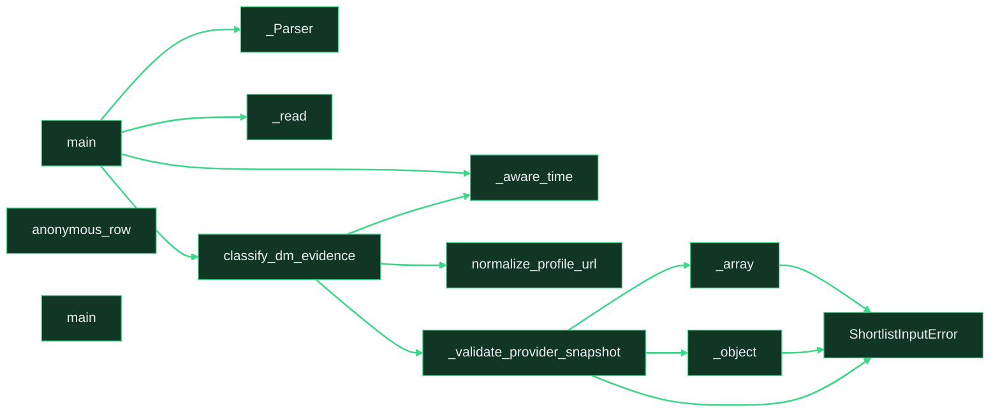

# `Reconcile legacy evidence and publish private DM reports`

Upload `card.png` with this comment: images do not embed from the repo.

Showing 12 of 311 changed symbols. Full map: map.html

## Look here first

- `main` in `scripts/build_private_dm_actions.py`
- `_Parser` in `scripts/build_private_dm_actions.py`
- `_read` in `scripts/build_private_dm_actions.py`

## Risky surfaces and description vs diff

- `.github/workflows/morning-report.yml`: CI workflow
- `.github/workflows/report-tests.yml`: CI workflow
- `.github/workflows/sync-connections.yml`: CI workflow

## Not covered by tests

- `FrozenInbox` in `diagnostics/verify_inbox_live.py`
- `FrozenInbox.__init__` in `diagnostics/verify_inbox_live.py`
- `FrozenInbox.snapshot` in `diagnostics/verify_inbox_live.py`
- `VerifiedStore` in `diagnostics/verify_inbox_live.py`
- `VerifiedStore.__init__` in `diagnostics/verify_inbox_live.py`
- `VerifiedStore.insert_events_ignore_duplicates` in `diagnostics/verify_inbox_live.py`
- `VerifiedStore.read_events` in `diagnostics/verify_inbox_live.py`
- `VerifiedStore.verify_readback` in `diagnostics/verify_inbox_live.py`
- `_require` in `diagnostics/verify_inbox_live.py`
- `main` in `diagnostics/verify_inbox_live.py`
- `verify` in `diagnostics/verify_inbox_live.py`
- `_Parser` in `scripts/build_invitation_shortlist.py`
- `_Parser.error` in `scripts/build_invitation_shortlist.py`
- `_arguments` in `scripts/build_invitation_shortlist.py`
- `_private_json` in `scripts/build_invitation_shortlist.py`
- `_write_new_private` in `scripts/build_invitation_shortlist.py`
- `main` in `scripts/build_invitation_shortlist.py`
- `_Parser` in `scripts/build_private_dm_actions.py`
- `_Parser.error` in `scripts/build_private_dm_actions.py`
- `_markdown` in `scripts/build_private_dm_actions.py`
- `_read` in `scripts/build_private_dm_actions.py`
- `_write` in `scripts/build_private_dm_actions.py`
- `main` in `scripts/build_private_dm_actions.py`
- `_Parser` in `scripts/publish_private_dm_docs.py`
- `_Parser.error` in `scripts/publish_private_dm_docs.py`
- `_clock` in `scripts/publish_private_dm_docs.py`
- `_publication_inputs` in `scripts/publish_private_dm_docs.py`
- `_read_private_json` in `scripts/publish_private_dm_docs.py`
- `main` in `scripts/publish_private_dm_docs.py`
- `_SnapshotStage` in `scripts/report_connections_doc.py`
- `_SnapshotStage.__init__` in `scripts/report_connections_doc.py`
- `_SnapshotStage.snapshot` in `scripts/report_connections_doc.py`
- `main` in `scripts/report_connections_doc.py`
- `main` in `scripts/sync_inbox.py`
- `LinkedInAPIError.__init__` in `src/linkedin_mdp_mcp/client.py`
- `LinkedInMDPClient._get_paged` in `src/linkedin_mdp_mcp/client.py`
- `LinkedInMDPClient._next_link` in `src/linkedin_mdp_mcp/client.py`
- `LinkedInMDPClient._validate_snapshot_paging` in `src/linkedin_mdp_mcp/client.py`
- `LinkedInMDPClient.changelog` in `src/linkedin_mdp_mcp/client.py`
- `LinkedInMDPClient.snapshot` in `src/linkedin_mdp_mcp/client.py`
- `DmEvidence` in `src/linkedin_mdp_mcp/dm_actions.py`
- `DmMessage` in `src/linkedin_mdp_mcp/dm_actions.py`
- `DmUnknown` in `src/linkedin_mdp_mcp/dm_actions.py`
- `_aware_time` in `src/linkedin_mdp_mcp/dm_actions.py`
- `_citation_url` in `src/linkedin_mdp_mcp/dm_actions.py`
- `_connection_day` in `src/linkedin_mdp_mcp/dm_actions.py`
- `_content` in `src/linkedin_mdp_mcp/dm_actions.py`
- `_date_added` in `src/linkedin_mdp_mcp/dm_actions.py`
- `_event_time` in `src/linkedin_mdp_mcp/dm_actions.py`
- `_fingerprint` in `src/linkedin_mdp_mcp/dm_actions.py`
- `_qualified` in `src/linkedin_mdp_mcp/dm_actions.py`
- `_row_identity` in `src/linkedin_mdp_mcp/dm_actions.py`
- `_row_time` in `src/linkedin_mdp_mcp/dm_actions.py`
- `_saved_draft` in `src/linkedin_mdp_mcp/dm_actions.py`
- `_thread_suffix` in `src/linkedin_mdp_mcp/dm_actions.py`
- `ConditionalFirstDmDraft` in `src/linkedin_mdp_mcp/dm_doc_report.py`
- `DmDocBodies` in `src/linkedin_mdp_mcp/dm_doc_report.py`
- `DmDocReportError` in `src/linkedin_mdp_mcp/dm_doc_report.py`
- `_actions` in `src/linkedin_mdp_mcp/dm_doc_report.py`
- `_citations` in `src/linkedin_mdp_mcp/dm_doc_report.py`
- `_common_message_fields` in `src/linkedin_mdp_mcp/dm_doc_report.py`
- `_coverage` in `src/linkedin_mdp_mcp/dm_doc_report.py`
- `_first_dm_row` in `src/linkedin_mdp_mcp/dm_doc_report.py`
- `_header` in `src/linkedin_mdp_mcp/dm_doc_report.py`
- `_message_row` in `src/linkedin_mdp_mcp/dm_doc_report.py`
- `_optional_text` in `src/linkedin_mdp_mcp/dm_doc_report.py`
- `_render_first_dm` in `src/linkedin_mdp_mcp/dm_doc_report.py`
- `_render_follow_up` in `src/linkedin_mdp_mcp/dm_doc_report.py`
- `_retained_evidence` in `src/linkedin_mdp_mcp/dm_doc_report.py`
- `_retained_row` in `src/linkedin_mdp_mcp/dm_doc_report.py`
- `_status` in `src/linkedin_mdp_mcp/dm_doc_report.py`
- `_text` in `src/linkedin_mdp_mcp/dm_doc_report.py`
- `_withheld_row` in `src/linkedin_mdp_mcp/dm_doc_report.py`
- `build_dm_doc_bodies` in `src/linkedin_mdp_mcp/dm_doc_report.py`
- `GoogleDocConfig` in `src/linkedin_mdp_mcp/google_doc_report.py`
- `GoogleDocPublisher.__init__` in `src/linkedin_mdp_mcp/google_doc_report.py`
- `GoogleDocPublisher._access_token` in `src/linkedin_mdp_mcp/google_doc_report.py`
- `GoogleDocPublisher._json_object` in `src/linkedin_mdp_mcp/google_doc_report.py`
- `GoogleDocPublisher._preflight` in `src/linkedin_mdp_mcp/google_doc_report.py`
- `GoogleDocPublisher._preflight_and_read` in `src/linkedin_mdp_mcp/google_doc_report.py`
- `GoogleDocPublisher._read_document` in `src/linkedin_mdp_mcp/google_doc_report.py`
- `GoogleDocPublisher._replace_region` in `src/linkedin_mdp_mcp/google_doc_report.py`
- `GoogleDocPublisher._request` in `src/linkedin_mdp_mcp/google_doc_report.py`
- `GoogleDocPublisher._require_success` in `src/linkedin_mdp_mcp/google_doc_report.py`
- `GoogleDocPublisher.aclose` in `src/linkedin_mdp_mcp/google_doc_report.py`
- `GoogleDocPublisher.prepare` in `src/linkedin_mdp_mcp/google_doc_report.py`
- `GoogleDocPublisher.publish` in `src/linkedin_mdp_mcp/google_doc_report.py`
- `GoogleReportError` in `src/linkedin_mdp_mcp/google_doc_report.py`
- `ReportCounts` in `src/linkedin_mdp_mcp/google_doc_report.py`
- `ReportResult` in `src/linkedin_mdp_mcp/google_doc_report.py`
- `ReportResult.__post_init__` in `src/linkedin_mdp_mcp/google_doc_report.py`
- `_is_revision_conflict` in `src/linkedin_mdp_mcp/google_doc_report.py`
- `_report_range` in `src/linkedin_mdp_mcp/google_doc_report.py`
- `as_counts` in `src/linkedin_mdp_mcp/google_doc_report.py`
- `render_report` in `src/linkedin_mdp_mcp/google_doc_report.py`
- `InboxSyncError` in `src/linkedin_mdp_mcp/inbox_sync.py`
- `InboxSyncPlan` in `src/linkedin_mdp_mcp/inbox_sync.py`
- `InboxSyncSummary` in `src/linkedin_mdp_mcp/inbox_sync.py`
- `_attachments` in `src/linkedin_mdp_mcp/inbox_sync.py`
- `_event_key` in `src/linkedin_mdp_mcp/inbox_sync.py`
- `_participants` in `src/linkedin_mdp_mcp/inbox_sync.py`
- `_safe_one_to_one_row` in `src/linkedin_mdp_mcp/inbox_sync.py`
- `_timestamp` in `src/linkedin_mdp_mcp/inbox_sync.py`
- `normalize_profile_url` in `src/linkedin_mdp_mcp/inbox_sync.py`
- `plan_inbox_events` in `src/linkedin_mdp_mcp/inbox_sync.py`
- `plan_inbox_events.skip` in `src/linkedin_mdp_mcp/inbox_sync.py`
- `Citation` in `src/linkedin_mdp_mcp/invitation_shortlist.py`
- `Company` in `src/linkedin_mdp_mcp/invitation_shortlist.py`
- `CurrentEmployer` in `src/linkedin_mdp_mcp/invitation_shortlist.py`
- `Factor` in `src/linkedin_mdp_mcp/invitation_shortlist.py`
- `HistoryEvidence` in `src/linkedin_mdp_mcp/invitation_shortlist.py`
- `QualifiedCandidate` in `src/linkedin_mdp_mcp/invitation_shortlist.py`
- `ShortlistInputError` in `src/linkedin_mdp_mcp/invitation_shortlist.py`
- `ShortlistInputError.__init__` in `src/linkedin_mdp_mcp/invitation_shortlist.py`
- `_array` in `src/linkedin_mdp_mcp/invitation_shortlist.py`
- `_attributes` in `src/linkedin_mdp_mcp/invitation_shortlist.py`
- `_candidate` in `src/linkedin_mdp_mcp/invitation_shortlist.py`
- `_candidate_json` in `src/linkedin_mdp_mcp/invitation_shortlist.py`
- `_citation_json` in `src/linkedin_mdp_mcp/invitation_shortlist.py`
- `_citation_list` in `src/linkedin_mdp_mcp/invitation_shortlist.py`
- `_company_registry` in `src/linkedin_mdp_mcp/invitation_shortlist.py`
- `_crm_history` in `src/linkedin_mdp_mcp/invitation_shortlist.py`
- `_crm_invited` in `src/linkedin_mdp_mcp/invitation_shortlist.py`
- `_crm_positive` in `src/linkedin_mdp_mcp/invitation_shortlist.py`
- `_crm_sent` in `src/linkedin_mdp_mcp/invitation_shortlist.py`
- `_current_employers` in `src/linkedin_mdp_mcp/invitation_shortlist.py`
- `_date` in `src/linkedin_mdp_mcp/invitation_shortlist.py`
- `_event_history` in `src/linkedin_mdp_mcp/invitation_shortlist.py`
- `_event_suppressed` in `src/linkedin_mdp_mcp/invitation_shortlist.py`
- `_factor_score` in `src/linkedin_mdp_mcp/invitation_shortlist.py`
- `_history_evidence_id` in `src/linkedin_mdp_mcp/invitation_shortlist.py`
- `_key` in `src/linkedin_mdp_mcp/invitation_shortlist.py`
- `_legacy_name` in `src/linkedin_mdp_mcp/invitation_shortlist.py`
- `_make_markdown` in `src/linkedin_mdp_mcp/invitation_shortlist.py`
- `_object` in `src/linkedin_mdp_mcp/invitation_shortlist.py`
- `_optional_timestamp` in `src/linkedin_mdp_mcp/invitation_shortlist.py`
- `_parse_factor` in `src/linkedin_mdp_mcp/invitation_shortlist.py`
- `_profile_queue_id` in `src/linkedin_mdp_mcp/invitation_shortlist.py`
- `_provider_history` in `src/linkedin_mdp_mcp/invitation_shortlist.py`
- `_provider_local_date` in `src/linkedin_mdp_mcp/invitation_shortlist.py`
- `_reconcile_legacy_history` in `src/linkedin_mdp_mcp/invitation_shortlist.py`
- `_source_history` in `src/linkedin_mdp_mcp/invitation_shortlist.py`
- `_source_profile_index` in `src/linkedin_mdp_mcp/invitation_shortlist.py`
- `_stable_hash` in `src/linkedin_mdp_mcp/invitation_shortlist.py`
- `_suppressed` in `src/linkedin_mdp_mcp/invitation_shortlist.py`
- `_timestamp` in `src/linkedin_mdp_mcp/invitation_shortlist.py`
- `_validate_database_snapshot` in `src/linkedin_mdp_mcp/invitation_shortlist.py`
- `_validate_provider_snapshot` in `src/linkedin_mdp_mcp/invitation_shortlist.py`

Files 62, symbols 311, CI 2/2.

*Written by prc from the code at head `5ec569d6f35a`.*
