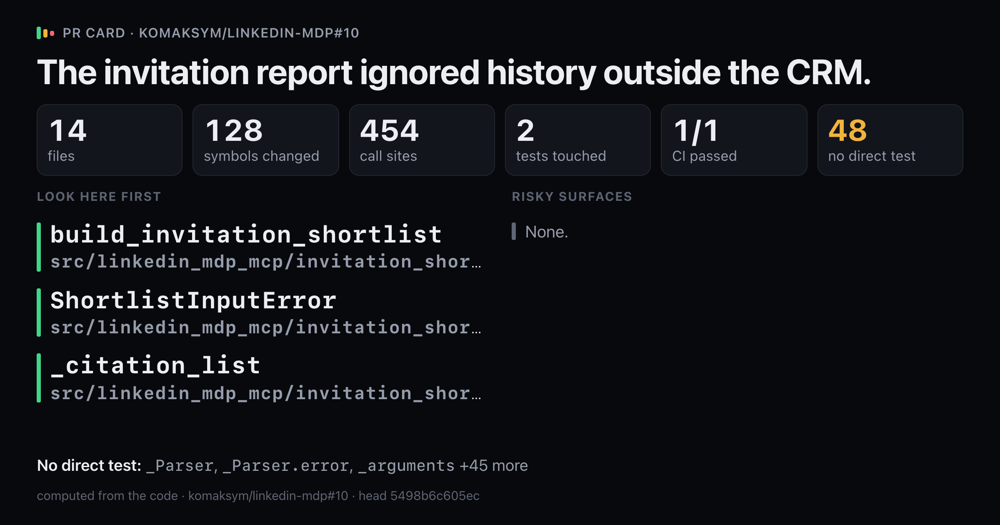
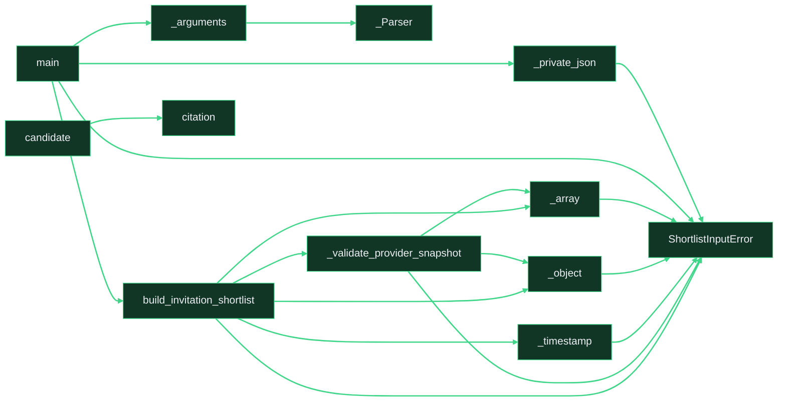

# `The invitation report ignored history outside the CRM.`

Upload `card.png` with this comment: images do not embed from the repo.

Showing 12 of 128 changed symbols. Full map: map.html

## Look here first

- `build_invitation_shortlist` in `src/linkedin_mdp_mcp/invitation_shortlist.py`
- `ShortlistInputError` in `src/linkedin_mdp_mcp/invitation_shortlist.py`
- `_citation_list` in `src/linkedin_mdp_mcp/invitation_shortlist.py`

## Risky surfaces and description vs diff

No risky surfaces.
Everything the description names is in the diff.

## Not covered by tests

- `_Parser` in `scripts/build_invitation_shortlist.py`
- `_Parser.error` in `scripts/build_invitation_shortlist.py`
- `_arguments` in `scripts/build_invitation_shortlist.py`
- `_private_json` in `scripts/build_invitation_shortlist.py`
- `_write_new_private` in `scripts/build_invitation_shortlist.py`
- `main` in `scripts/build_invitation_shortlist.py`
- `Citation` in `src/linkedin_mdp_mcp/invitation_shortlist.py`
- `Company` in `src/linkedin_mdp_mcp/invitation_shortlist.py`
- `CurrentEmployer` in `src/linkedin_mdp_mcp/invitation_shortlist.py`
- `Factor` in `src/linkedin_mdp_mcp/invitation_shortlist.py`
- `HistoryEvidence` in `src/linkedin_mdp_mcp/invitation_shortlist.py`
- `QualifiedCandidate` in `src/linkedin_mdp_mcp/invitation_shortlist.py`
- `ShortlistInputError` in `src/linkedin_mdp_mcp/invitation_shortlist.py`
- `ShortlistInputError.__init__` in `src/linkedin_mdp_mcp/invitation_shortlist.py`
- `_array` in `src/linkedin_mdp_mcp/invitation_shortlist.py`
- `_attributes` in `src/linkedin_mdp_mcp/invitation_shortlist.py`
- `_candidate` in `src/linkedin_mdp_mcp/invitation_shortlist.py`
- `_candidate_json` in `src/linkedin_mdp_mcp/invitation_shortlist.py`
- `_citation_json` in `src/linkedin_mdp_mcp/invitation_shortlist.py`
- `_citation_list` in `src/linkedin_mdp_mcp/invitation_shortlist.py`
- `_company_registry` in `src/linkedin_mdp_mcp/invitation_shortlist.py`
- `_crm_history` in `src/linkedin_mdp_mcp/invitation_shortlist.py`
- `_crm_invited` in `src/linkedin_mdp_mcp/invitation_shortlist.py`
- `_crm_positive` in `src/linkedin_mdp_mcp/invitation_shortlist.py`
- `_crm_sent` in `src/linkedin_mdp_mcp/invitation_shortlist.py`
- `_current_employers` in `src/linkedin_mdp_mcp/invitation_shortlist.py`
- `_date` in `src/linkedin_mdp_mcp/invitation_shortlist.py`
- `_event_history` in `src/linkedin_mdp_mcp/invitation_shortlist.py`
- `_event_suppressed` in `src/linkedin_mdp_mcp/invitation_shortlist.py`
- `_factor_score` in `src/linkedin_mdp_mcp/invitation_shortlist.py`
- `_history_evidence_id` in `src/linkedin_mdp_mcp/invitation_shortlist.py`
- `_key` in `src/linkedin_mdp_mcp/invitation_shortlist.py`
- `_legacy_name` in `src/linkedin_mdp_mcp/invitation_shortlist.py`
- `_make_markdown` in `src/linkedin_mdp_mcp/invitation_shortlist.py`
- `_object` in `src/linkedin_mdp_mcp/invitation_shortlist.py`
- `_optional_timestamp` in `src/linkedin_mdp_mcp/invitation_shortlist.py`
- `_parse_factor` in `src/linkedin_mdp_mcp/invitation_shortlist.py`
- `_profile_queue_id` in `src/linkedin_mdp_mcp/invitation_shortlist.py`
- `_provider_history` in `src/linkedin_mdp_mcp/invitation_shortlist.py`
- `_provider_local_date` in `src/linkedin_mdp_mcp/invitation_shortlist.py`
- `_reconcile_legacy_history` in `src/linkedin_mdp_mcp/invitation_shortlist.py`
- `_source_history` in `src/linkedin_mdp_mcp/invitation_shortlist.py`
- `_source_profile_index` in `src/linkedin_mdp_mcp/invitation_shortlist.py`
- `_stable_hash` in `src/linkedin_mdp_mcp/invitation_shortlist.py`
- `_suppressed` in `src/linkedin_mdp_mcp/invitation_shortlist.py`
- `_timestamp` in `src/linkedin_mdp_mcp/invitation_shortlist.py`
- `_validate_database_snapshot` in `src/linkedin_mdp_mcp/invitation_shortlist.py`
- `_validate_provider_snapshot` in `src/linkedin_mdp_mcp/invitation_shortlist.py`

Files 14, symbols 128, CI 1/1.

*Written by prc from the code at head `5498b6c605ec`.*
