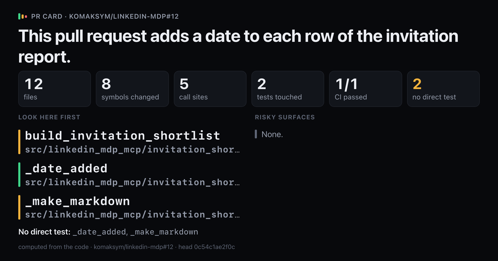
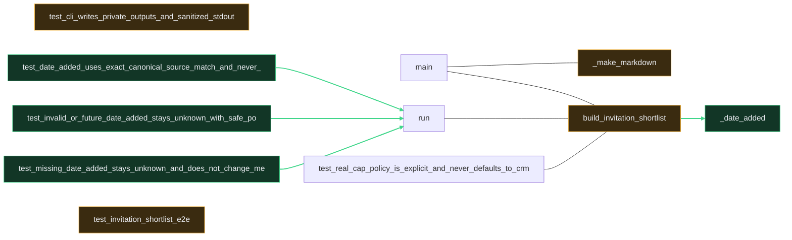

# `This pull request adds a date to each row of the invitation report.`

Upload `card.png` with this comment: images do not embed from the repo.

## Look here first

- `build_invitation_shortlist` in `src/linkedin_mdp_mcp/invitation_shortlist.py`
- `_date_added` in `src/linkedin_mdp_mcp/invitation_shortlist.py`
- `_make_markdown` in `src/linkedin_mdp_mcp/invitation_shortlist.py`

## Risky surfaces and description vs diff

No risky surfaces.
Everything the description names is in the diff.

## Not covered by tests

- `_date_added` in `src/linkedin_mdp_mcp/invitation_shortlist.py`
- `_make_markdown` in `src/linkedin_mdp_mcp/invitation_shortlist.py`

Files 12, symbols 8, CI 1/1.

*Written by prc from the code at head `0c54c1ae2f0c`.*
