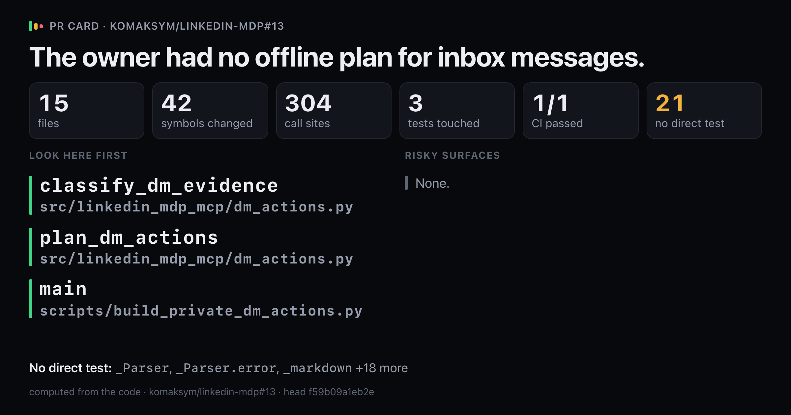
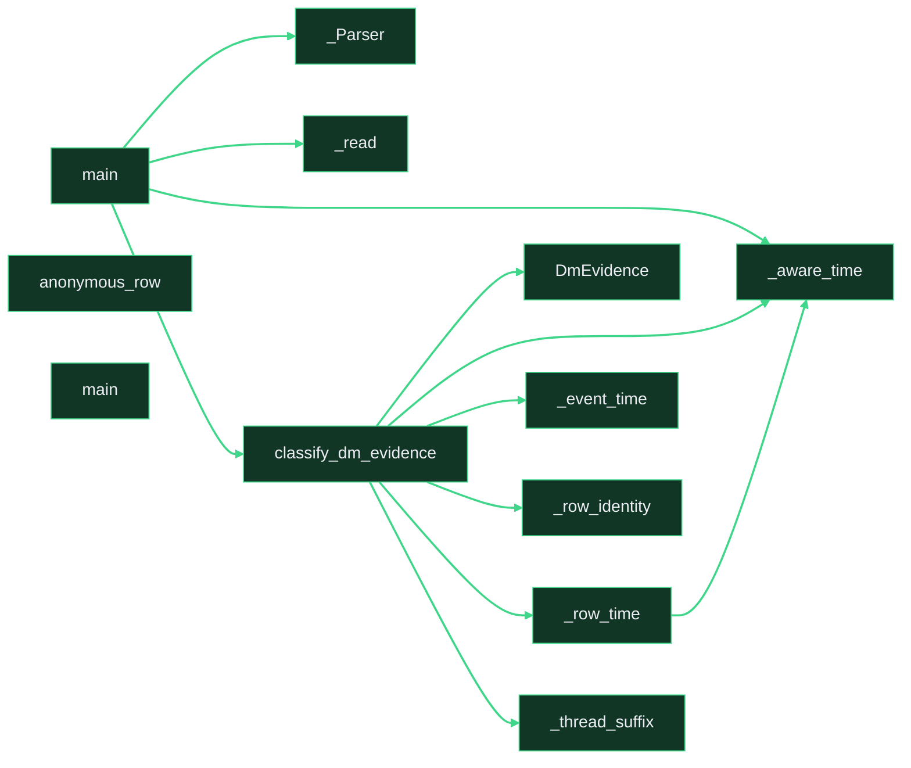

# `The owner had no offline plan for inbox messages.`

Upload `card.png` with this comment: images do not embed from the repo.

Showing 12 of 42 changed symbols. Full map: map.html

## Look here first

- `classify_dm_evidence` in `src/linkedin_mdp_mcp/dm_actions.py`
- `plan_dm_actions` in `src/linkedin_mdp_mcp/dm_actions.py`
- `main` in `scripts/build_private_dm_actions.py`

## Risky surfaces and description vs diff

No risky surfaces.
Everything the description names is in the diff.

## Not covered by tests

- `_Parser` in `scripts/build_private_dm_actions.py`
- `_Parser.error` in `scripts/build_private_dm_actions.py`
- `_markdown` in `scripts/build_private_dm_actions.py`
- `_read` in `scripts/build_private_dm_actions.py`
- `_write` in `scripts/build_private_dm_actions.py`
- `main` in `scripts/build_private_dm_actions.py`
- `DmEvidence` in `src/linkedin_mdp_mcp/dm_actions.py`
- `DmMessage` in `src/linkedin_mdp_mcp/dm_actions.py`
- `DmUnknown` in `src/linkedin_mdp_mcp/dm_actions.py`
- `_aware_time` in `src/linkedin_mdp_mcp/dm_actions.py`
- `_citation_url` in `src/linkedin_mdp_mcp/dm_actions.py`
- `_connection_day` in `src/linkedin_mdp_mcp/dm_actions.py`
- `_content` in `src/linkedin_mdp_mcp/dm_actions.py`
- `_date_added` in `src/linkedin_mdp_mcp/dm_actions.py`
- `_event_time` in `src/linkedin_mdp_mcp/dm_actions.py`
- `_fingerprint` in `src/linkedin_mdp_mcp/dm_actions.py`
- `_qualified` in `src/linkedin_mdp_mcp/dm_actions.py`
- `_row_identity` in `src/linkedin_mdp_mcp/dm_actions.py`
- `_row_time` in `src/linkedin_mdp_mcp/dm_actions.py`
- `_saved_draft` in `src/linkedin_mdp_mcp/dm_actions.py`
- `_thread_suffix` in `src/linkedin_mdp_mcp/dm_actions.py`

Files 15, symbols 42, CI 1/1.

*Written by prc from the code at head `f59b09a1eb2e`.*
