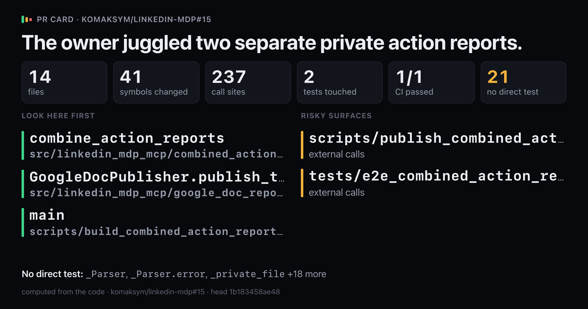
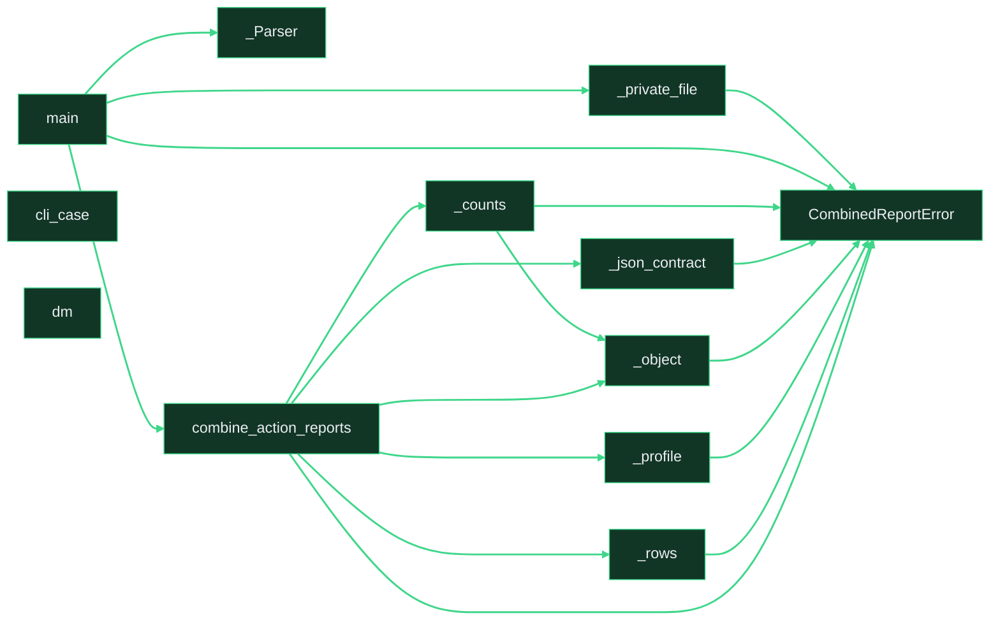

# `The owner juggled two separate private action reports.`

Upload `card.png` with this comment: images do not embed from the repo.

Showing 12 of 41 changed symbols. Full map: map.html

## Look here first

- `combine_action_reports` in `src/linkedin_mdp_mcp/combined_action_report.py`
- `GoogleDocPublisher.publish_text` in `src/linkedin_mdp_mcp/google_doc_report.py`
- `main` in `scripts/build_combined_action_report.py`

## Risky surfaces and description vs diff

- `scripts/publish_combined_action_report.py`: external calls
- `tests/e2e_combined_action_report.py`: external calls

## Not covered by tests

- `_Parser` in `scripts/build_combined_action_report.py`
- `_Parser.error` in `scripts/build_combined_action_report.py`
- `_private_file` in `scripts/build_combined_action_report.py`
- `_remove_owned` in `scripts/build_combined_action_report.py`
- `_write` in `scripts/build_combined_action_report.py`
- `_Parser` in `scripts/publish_combined_action_report.py`
- `_Parser.error` in `scripts/publish_combined_action_report.py`
- `_publish` in `scripts/publish_combined_action_report.py`
- `CombinedReportError` in `src/linkedin_mdp_mcp/combined_action_report.py`
- `_citations` in `src/linkedin_mdp_mcp/combined_action_report.py`
- `_counts` in `src/linkedin_mdp_mcp/combined_action_report.py`
- `_dm_lines` in `src/linkedin_mdp_mcp/combined_action_report.py`
- `_invitation_lines` in `src/linkedin_mdp_mcp/combined_action_report.py`
- `_json_contract` in `src/linkedin_mdp_mcp/combined_action_report.py`
- `_object` in `src/linkedin_mdp_mcp/combined_action_report.py`
- `_profile` in `src/linkedin_mdp_mcp/combined_action_report.py`
- `_rows` in `src/linkedin_mdp_mcp/combined_action_report.py`
- `_show` in `src/linkedin_mdp_mcp/combined_action_report.py`
- `_string` in `src/linkedin_mdp_mcp/combined_action_report.py`
- `GoogleDocPublisher.publish` in `src/linkedin_mdp_mcp/google_doc_report.py`
- `validate_report_text` in `src/linkedin_mdp_mcp/google_doc_report.py`

Files 14, symbols 41, CI 1/1.

*Written by prc from the code at head `1b183458ae48`.*
