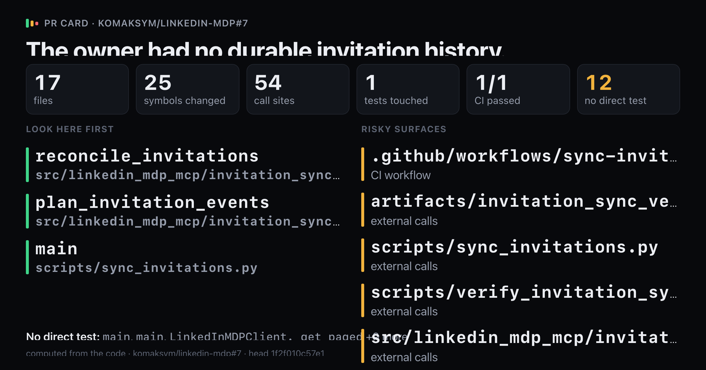
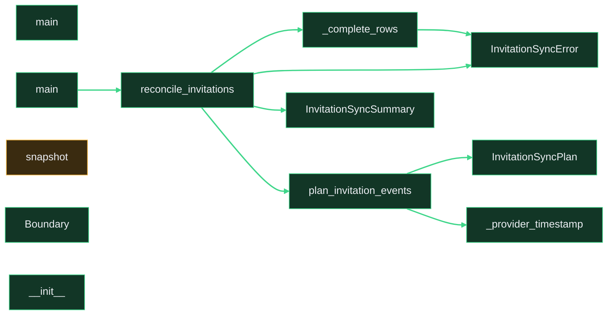

# `The owner had no durable invitation history.`

Upload `card.png` with this comment: images do not embed from the repo.

Showing 12 of 25 changed symbols. Full map: map.html

## Look here first

- `reconcile_invitations` in `src/linkedin_mdp_mcp/invitation_sync.py`
- `plan_invitation_events` in `src/linkedin_mdp_mcp/invitation_sync.py`
- `main` in `scripts/sync_invitations.py`

## Risky surfaces and description vs diff

- `.github/workflows/sync-invitations.yml`: CI workflow
- `artifacts/invitation_sync_verification.json`: external calls
- `scripts/sync_invitations.py`: external calls
- `scripts/verify_invitation_sync.py`: external calls
- `src/linkedin_mdp_mcp/invitation_sync.py`: external calls
- `tests/test_invitation_sync_e2e.py`: external calls

## Not covered by tests

- `main` in `scripts/sync_invitations.py`
- `main` in `scripts/verify_invitation_sync.py`
- `LinkedInMDPClient._get_paged` in `src/linkedin_mdp_mcp/client.py`
- `LinkedInMDPClient._next_link` in `src/linkedin_mdp_mcp/client.py`
- `LinkedInMDPClient.changelog` in `src/linkedin_mdp_mcp/client.py`
- `LinkedInMDPClient.snapshot` in `src/linkedin_mdp_mcp/client.py`
- `InvitationSyncError` in `src/linkedin_mdp_mcp/invitation_sync.py`
- `InvitationSyncPlan` in `src/linkedin_mdp_mcp/invitation_sync.py`
- `InvitationSyncSummary` in `src/linkedin_mdp_mcp/invitation_sync.py`
- `_complete_rows` in `src/linkedin_mdp_mcp/invitation_sync.py`
- `_provider_timestamp` in `src/linkedin_mdp_mcp/invitation_sync.py`
- `plan_invitation_events` in `src/linkedin_mdp_mcp/invitation_sync.py`

Files 17, symbols 25, CI 1/1.

*Written by prc from the code at head `1f2f010c57e1`.*
