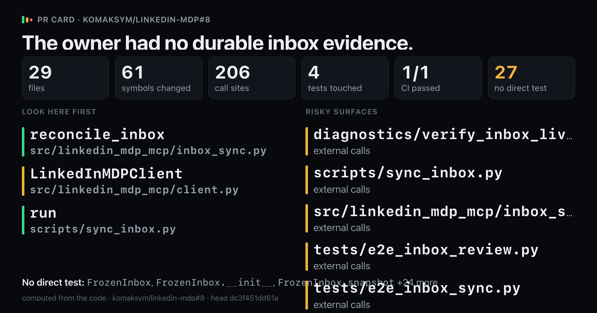
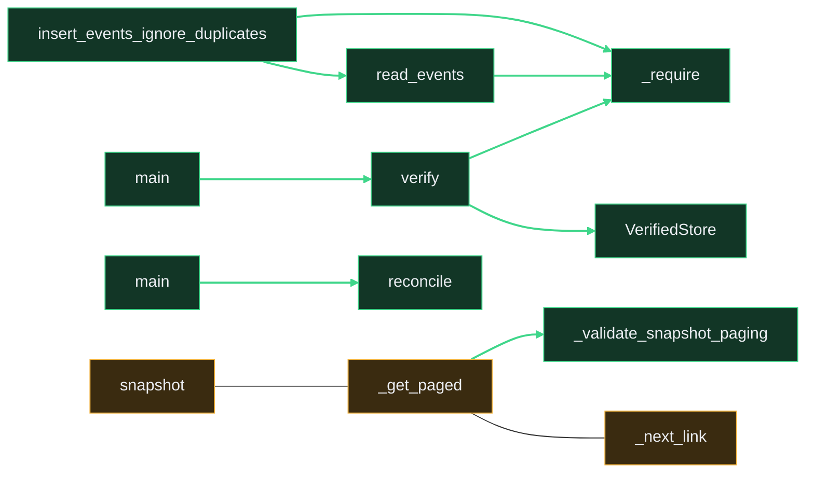

# `The owner had no durable inbox evidence.`

Upload `card.png` with this comment: images do not embed from the repo.

Showing 12 of 61 changed symbols. Full map: map.html

## Look here first

- `reconcile_inbox` in `src/linkedin_mdp_mcp/inbox_sync.py`
- `LinkedInMDPClient` in `src/linkedin_mdp_mcp/client.py`
- `run` in `scripts/sync_inbox.py`

## Risky surfaces and description vs diff

- `diagnostics/verify_inbox_live.py`: external calls
- `scripts/sync_inbox.py`: external calls
- `src/linkedin_mdp_mcp/inbox_sync.py`: external calls
- `tests/e2e_inbox_review.py`: external calls
- `tests/e2e_inbox_sync.py`: external calls

## Not covered by tests

- `FrozenInbox` in `diagnostics/verify_inbox_live.py`
- `FrozenInbox.__init__` in `diagnostics/verify_inbox_live.py`
- `FrozenInbox.snapshot` in `diagnostics/verify_inbox_live.py`
- `VerifiedStore` in `diagnostics/verify_inbox_live.py`
- `VerifiedStore.__init__` in `diagnostics/verify_inbox_live.py`
- `VerifiedStore.insert_events_ignore_duplicates` in `diagnostics/verify_inbox_live.py`
- `VerifiedStore.read_events` in `diagnostics/verify_inbox_live.py`
- `VerifiedStore.verify_readback` in `diagnostics/verify_inbox_live.py`
- `_require` in `diagnostics/verify_inbox_live.py`
- `main` in `diagnostics/verify_inbox_live.py`
- `verify` in `diagnostics/verify_inbox_live.py`
- `main` in `scripts/sync_inbox.py`
- `LinkedInMDPClient._get_paged` in `src/linkedin_mdp_mcp/client.py`
- `LinkedInMDPClient._next_link` in `src/linkedin_mdp_mcp/client.py`
- `LinkedInMDPClient._validate_snapshot_paging` in `src/linkedin_mdp_mcp/client.py`
- `LinkedInMDPClient.snapshot` in `src/linkedin_mdp_mcp/client.py`
- `InboxSyncError` in `src/linkedin_mdp_mcp/inbox_sync.py`
- `InboxSyncPlan` in `src/linkedin_mdp_mcp/inbox_sync.py`
- `InboxSyncSummary` in `src/linkedin_mdp_mcp/inbox_sync.py`
- `_attachments` in `src/linkedin_mdp_mcp/inbox_sync.py`
- `_event_key` in `src/linkedin_mdp_mcp/inbox_sync.py`
- `_participants` in `src/linkedin_mdp_mcp/inbox_sync.py`
- `_safe_one_to_one_row` in `src/linkedin_mdp_mcp/inbox_sync.py`
- `_timestamp` in `src/linkedin_mdp_mcp/inbox_sync.py`
- `normalize_profile_url` in `src/linkedin_mdp_mcp/inbox_sync.py`
- `plan_inbox_events` in `src/linkedin_mdp_mcp/inbox_sync.py`
- `plan_inbox_events.skip` in `src/linkedin_mdp_mcp/inbox_sync.py`

Files 29, symbols 61, CI 1/1.

*Written by prc from the code at head `dc3f451dd61a`.*
