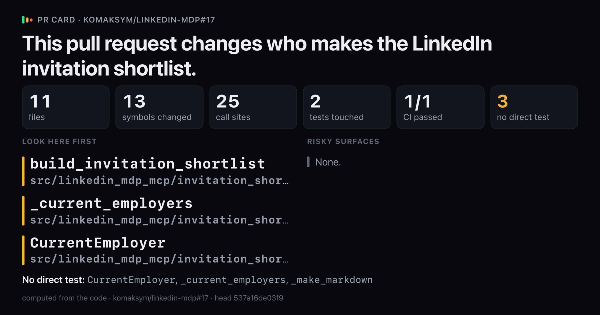
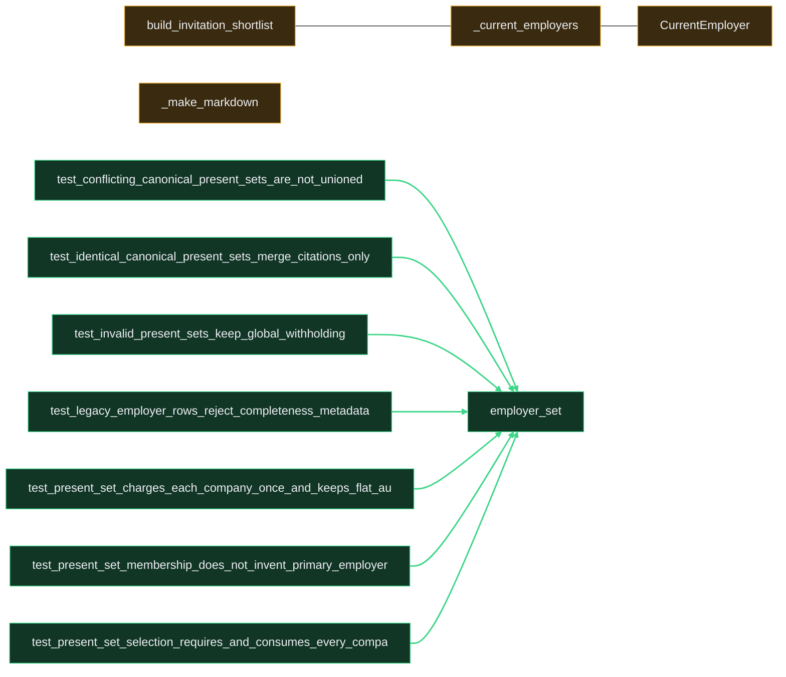

# `This pull request changes who makes the LinkedIn invitation shortlist.`

Upload `card.png` with this comment: images do not embed from the repo.

Showing 12 of 13 changed symbols. Full map: map.html

## Look here first

- `build_invitation_shortlist` in `src/linkedin_mdp_mcp/invitation_shortlist.py`
- `_current_employers` in `src/linkedin_mdp_mcp/invitation_shortlist.py`
- `CurrentEmployer` in `src/linkedin_mdp_mcp/invitation_shortlist.py`

## Risky surfaces and description vs diff

No risky surfaces.
Everything the description names is in the diff.

## Not covered by tests

- `CurrentEmployer` in `src/linkedin_mdp_mcp/invitation_shortlist.py`
- `_current_employers` in `src/linkedin_mdp_mcp/invitation_shortlist.py`
- `_make_markdown` in `src/linkedin_mdp_mcp/invitation_shortlist.py`

Files 11, symbols 13, CI 1/1.

*Written by prc from the code at head `537a16de03f9`.*
