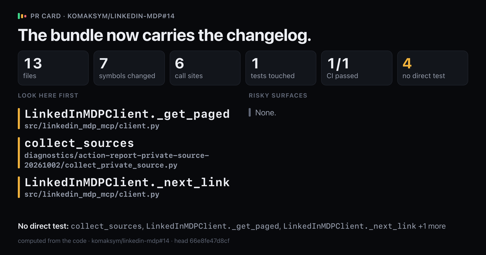
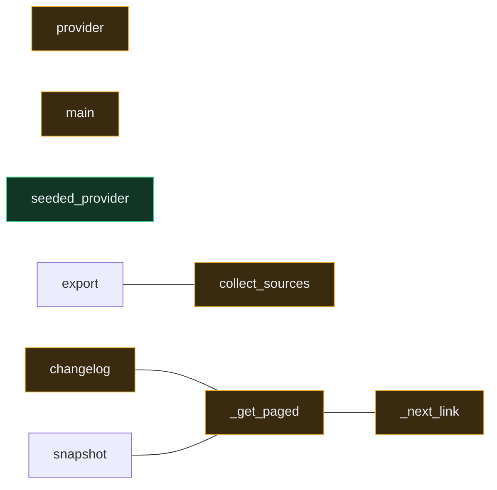

# `The bundle now carries the changelog.`

Upload `card.png` with this comment: images do not embed from the repo.

## Look here first

- `LinkedInMDPClient._get_paged` in `src/linkedin_mdp_mcp/client.py`
- `collect_sources` in `diagnostics/action-report-private-source-20261002/collect_private_source.py`
- `LinkedInMDPClient._next_link` in `src/linkedin_mdp_mcp/client.py`

## Risky surfaces and description vs diff

No risky surfaces.
Everything the description names is in the diff.

## Not covered by tests

- `collect_sources` in `diagnostics/action-report-private-source-20261002/collect_private_source.py`
- `LinkedInMDPClient._get_paged` in `src/linkedin_mdp_mcp/client.py`
- `LinkedInMDPClient._next_link` in `src/linkedin_mdp_mcp/client.py`
- `LinkedInMDPClient.changelog` in `src/linkedin_mdp_mcp/client.py`

Files 13, symbols 7, CI 1/1.

*Written by prc from the code at head `66e8fe47d8cf`.*
