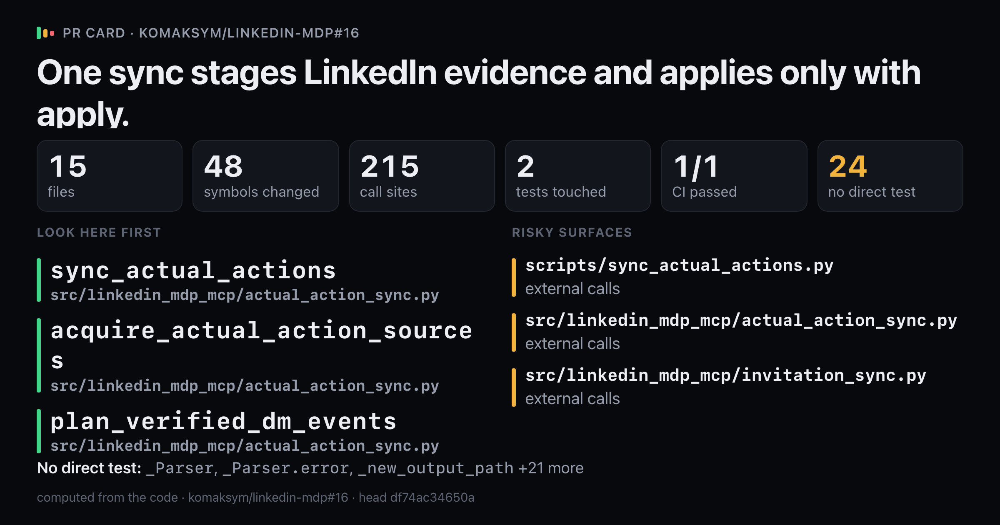
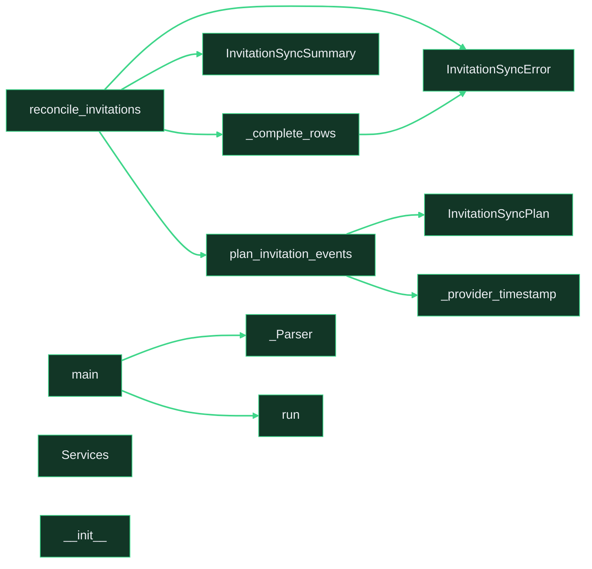

# `One sync stages LinkedIn evidence and applies only with apply.`

Upload `card.png` with this comment: images do not embed from the repo.

Showing 12 of 48 changed symbols. Full map: map.html

## Look here first

- `sync_actual_actions` in `src/linkedin_mdp_mcp/actual_action_sync.py`
- `acquire_actual_action_sources` in `src/linkedin_mdp_mcp/actual_action_sync.py`
- `plan_verified_dm_events` in `src/linkedin_mdp_mcp/actual_action_sync.py`

## Risky surfaces and description vs diff

- `scripts/sync_actual_actions.py`: external calls
- `src/linkedin_mdp_mcp/actual_action_sync.py`: external calls
- `src/linkedin_mdp_mcp/invitation_sync.py`: external calls

## Not covered by tests

- `_Parser` in `scripts/sync_actual_actions.py`
- `_Parser.error` in `scripts/sync_actual_actions.py`
- `_new_output_path` in `scripts/sync_actual_actions.py`
- `_write_manifest` in `scripts/sync_actual_actions.py`
- `main` in `scripts/sync_actual_actions.py`
- `ActualActionSyncSummary` in `src/linkedin_mdp_mcp/actual_action_sync.py`
- `ActualSyncError` in `src/linkedin_mdp_mcp/actual_action_sync.py`
- `ActualSyncError.__init__` in `src/linkedin_mdp_mcp/actual_action_sync.py`
- `DmSyncPlan` in `src/linkedin_mdp_mcp/actual_action_sync.py`
- `_aware` in `src/linkedin_mdp_mcp/actual_action_sync.py`
- `_digest` in `src/linkedin_mdp_mcp/actual_action_sync.py`
- `_fresh` in `src/linkedin_mdp_mcp/actual_action_sync.py`
- `_matched_source` in `src/linkedin_mdp_mcp/actual_action_sync.py`
- `_validate_sources` in `src/linkedin_mdp_mcp/actual_action_sync.py`
- `LinkedInMDPClient._get_paged` in `src/linkedin_mdp_mcp/client.py`
- `LinkedInMDPClient._next_link` in `src/linkedin_mdp_mcp/client.py`
- `LinkedInMDPClient.changelog` in `src/linkedin_mdp_mcp/client.py`
- `InvitationSyncError` in `src/linkedin_mdp_mcp/invitation_sync.py`
- `InvitationSyncPlan` in `src/linkedin_mdp_mcp/invitation_sync.py`
- `InvitationSyncSummary` in `src/linkedin_mdp_mcp/invitation_sync.py`
- `_complete_rows` in `src/linkedin_mdp_mcp/invitation_sync.py`
- `_provider_timestamp` in `src/linkedin_mdp_mcp/invitation_sync.py`
- `plan_invitation_events` in `src/linkedin_mdp_mcp/invitation_sync.py`
- `reconcile_invitations` in `src/linkedin_mdp_mcp/invitation_sync.py`

Files 15, symbols 48, CI 1/1.

*Written by prc from the code at head `df74ac34650a`.*
