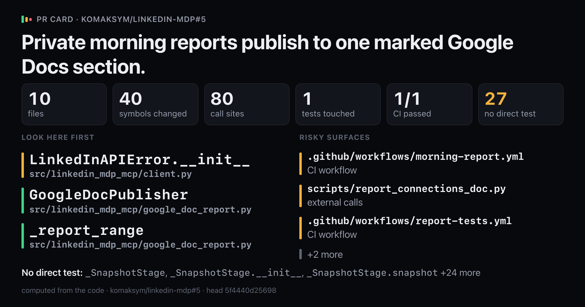
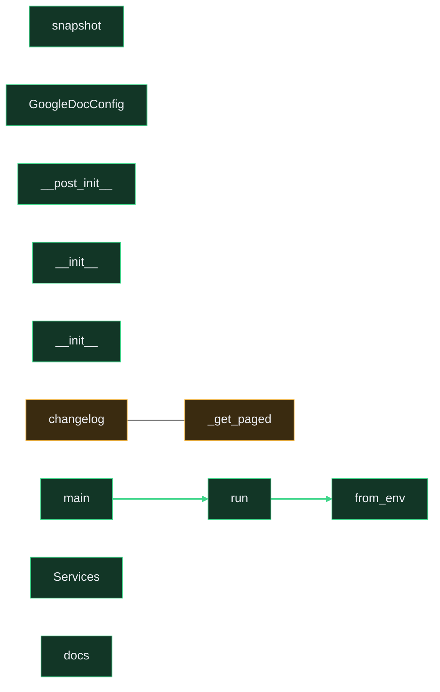

# `Private morning reports publish to one marked Google Docs section.`

Upload `card.png` with this comment: images do not embed from the repo.

Showing 12 of 40 changed symbols. Full map: map.html

## Look here first

- `LinkedInAPIError.__init__` in `src/linkedin_mdp_mcp/client.py`
- `GoogleDocPublisher` in `src/linkedin_mdp_mcp/google_doc_report.py`
- `_report_range` in `src/linkedin_mdp_mcp/google_doc_report.py`

## Risky surfaces and description vs diff

- `.github/workflows/morning-report.yml`: CI workflow
- `scripts/report_connections_doc.py`: external calls
- `.github/workflows/report-tests.yml`: CI workflow
- `src/linkedin_mdp_mcp/google_doc_report.py`: external calls
- `.github/workflows/sync-connections.yml`: CI workflow

## Not covered by tests

- `_SnapshotStage` in `scripts/report_connections_doc.py`
- `_SnapshotStage.__init__` in `scripts/report_connections_doc.py`
- `_SnapshotStage.snapshot` in `scripts/report_connections_doc.py`
- `main` in `scripts/report_connections_doc.py`
- `LinkedInAPIError.__init__` in `src/linkedin_mdp_mcp/client.py`
- `LinkedInMDPClient._get_paged` in `src/linkedin_mdp_mcp/client.py`
- `LinkedInMDPClient.changelog` in `src/linkedin_mdp_mcp/client.py`
- `GoogleDocConfig` in `src/linkedin_mdp_mcp/google_doc_report.py`
- `GoogleDocPublisher.__init__` in `src/linkedin_mdp_mcp/google_doc_report.py`
- `GoogleDocPublisher._access_token` in `src/linkedin_mdp_mcp/google_doc_report.py`
- `GoogleDocPublisher._json_object` in `src/linkedin_mdp_mcp/google_doc_report.py`
- `GoogleDocPublisher._preflight` in `src/linkedin_mdp_mcp/google_doc_report.py`
- `GoogleDocPublisher._preflight_and_read` in `src/linkedin_mdp_mcp/google_doc_report.py`
- `GoogleDocPublisher._read_document` in `src/linkedin_mdp_mcp/google_doc_report.py`
- `GoogleDocPublisher._request` in `src/linkedin_mdp_mcp/google_doc_report.py`
- `GoogleDocPublisher._require_success` in `src/linkedin_mdp_mcp/google_doc_report.py`
- `GoogleDocPublisher.aclose` in `src/linkedin_mdp_mcp/google_doc_report.py`
- `GoogleDocPublisher.prepare` in `src/linkedin_mdp_mcp/google_doc_report.py`
- `GoogleDocPublisher.publish` in `src/linkedin_mdp_mcp/google_doc_report.py`
- `GoogleReportError` in `src/linkedin_mdp_mcp/google_doc_report.py`
- `ReportCounts` in `src/linkedin_mdp_mcp/google_doc_report.py`
- `ReportResult` in `src/linkedin_mdp_mcp/google_doc_report.py`
- `ReportResult.__post_init__` in `src/linkedin_mdp_mcp/google_doc_report.py`
- `_is_revision_conflict` in `src/linkedin_mdp_mcp/google_doc_report.py`
- `_report_range` in `src/linkedin_mdp_mcp/google_doc_report.py`
- `as_counts` in `src/linkedin_mdp_mcp/google_doc_report.py`
- `render_report` in `src/linkedin_mdp_mcp/google_doc_report.py`

Files 10, symbols 40, CI 1/1.

*Written by prc from the code at head `5f4440d25698`.*
